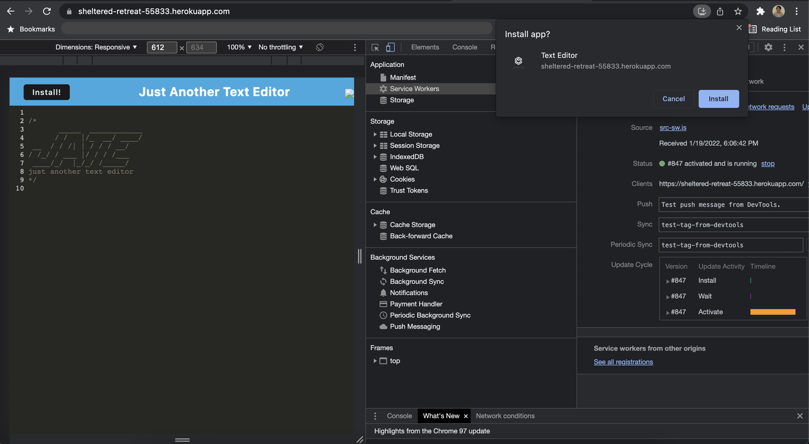

# text-editor

## Description
--------------
Text Editor is a web application where user can type anything they like. The application is powered by service workers, webpack, IndexedDB, idb, manifest, and syles and babel loader, all of which enable the application to work without an internet connection, serve as redundancy in case one of the options is not supported by the browser, installed as a Progressive Web Application and much more!

## Table of Contents

- [Description](#description)
- [User Story](#user-story)
- [Acceptance Criteria](#acceptance-criteria)
- [Installation](#installation)
- [Usage](#usage)
- [Contributing](#contributing)
- [Review](#review)
- [Mock Up](#mock-up)
- [Questions](#questions)


## User Story

```md
AS A developer
I WANT to create notes or code snippets with or without an internet connection
SO THAT I can reliably retrieve them for later use
```

## Acceptance Criteria

```md
GIVEN a text editor web application
WHEN I open my application in my editor
THEN I should see a client server folder structure
WHEN I run `npm run start` from the root directory
THEN I find that my application should start up the backend and serve the client
WHEN I run the text editor application from my terminal
THEN I find that my JavaScript files have been bundled using webpack
WHEN I run my webpack plugins
THEN I find that I have a generated HTML file, service worker, and a manifest file
WHEN I use next-gen JavaScript in my application
THEN I find that the text editor still functions in the browser without errors
WHEN I open the text editor
THEN I find that IndexedDB has immediately created a database storage
WHEN I enter content and subsequently click off of the DOM window
THEN I find that the content in the text editor has been saved with IndexedDB
WHEN I reopen the text editor after closing it
THEN I find that the content in the text editor has been retrieved from our IndexedDB
WHEN I click on the Install button
THEN I download my web application as an icon on my desktop
WHEN I load my web application
THEN I should have a registered service worker using workbox
WHEN I register a service worker
THEN I should have my static assets pre cached upon loading along with subsequent pages and static assets
WHEN I deploy to Heroku
THEN I should have proper build scripts for a webpack application
```

## Installation
---
```bash
npm i
```

## Usage
---
Run the following command at the root folder of project:

```bash
npm start
```

## Mock Up
---
The following screenshot displays the app:



## Contributing
---
Pull requests are welcome. For major changes, please open an issue first to discuss what you would like to change.

## Review
---
To review the code, please go to the [repository](https://github.com/sistaniabong/text-editor)

To check out the application, please go to the [deployed-link](https://sheltered-retreat-55833.herokuapp.com/)


## Questions
---
If you have any questions, please feel free to check out my github account and email me at the email address below:

Github account: [sistaniabong](https://github.com/sistaniabong)

Email address: sistaniawibonele@gmail.com